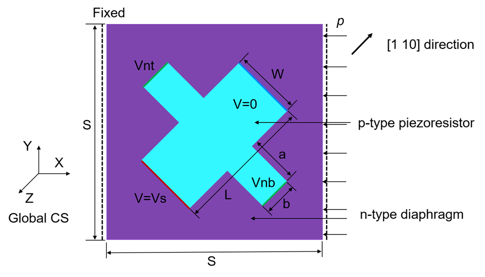
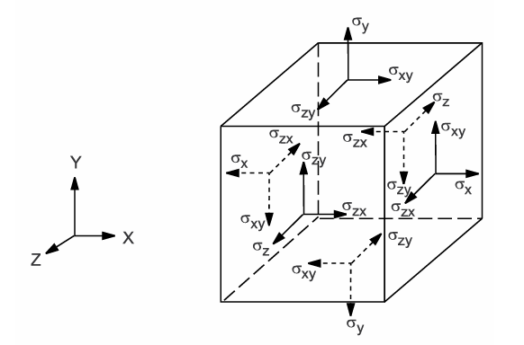
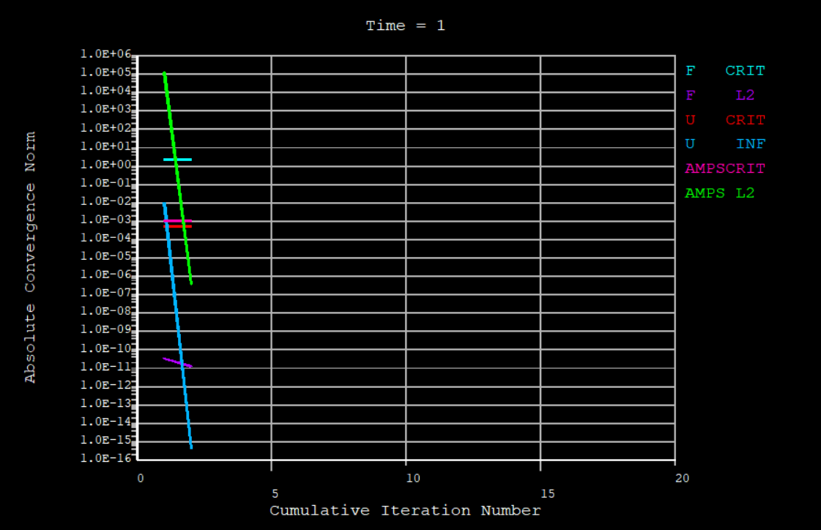
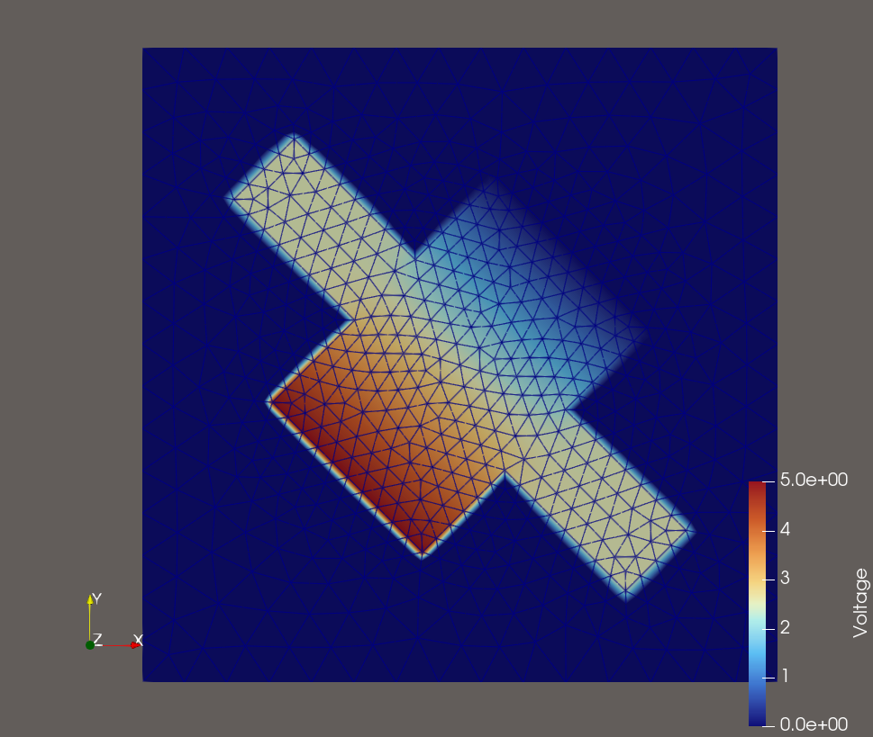
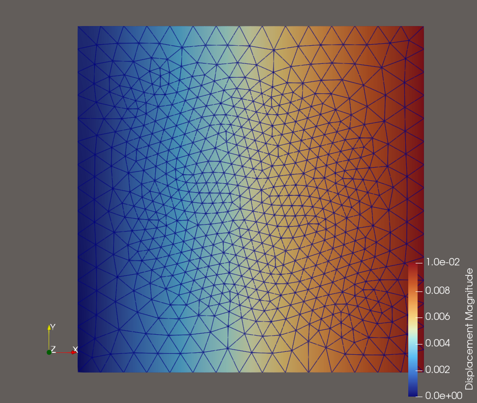
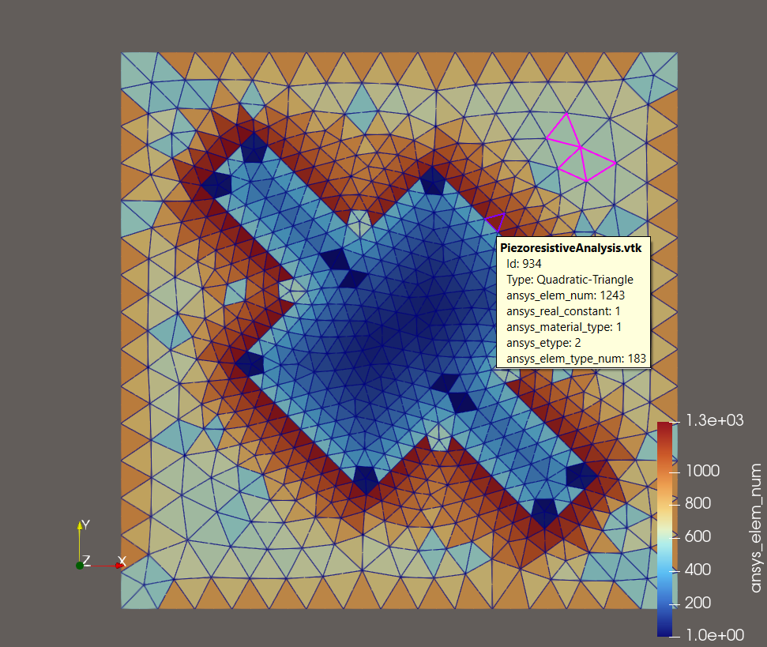
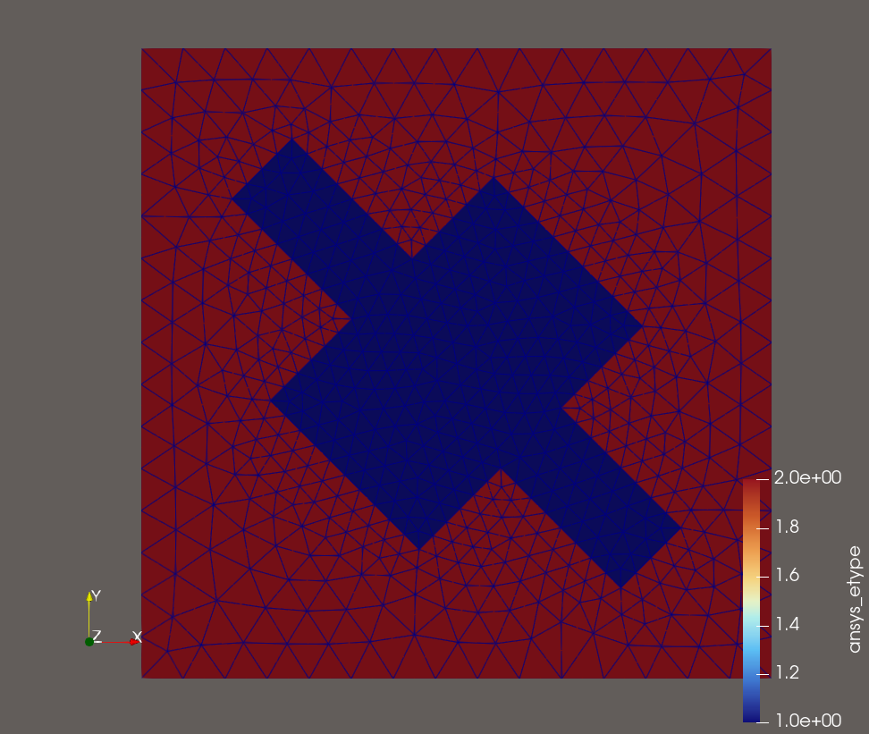
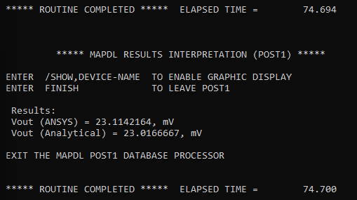
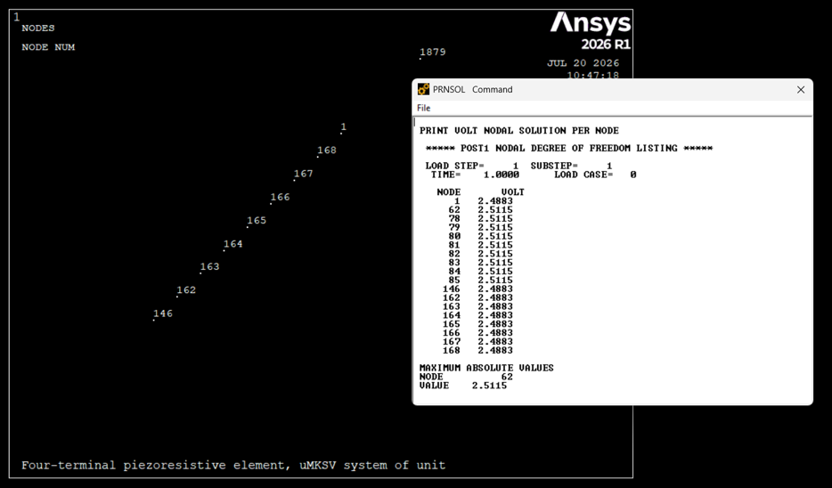

# Example: Piezoresistive Analysis

This example models a piezoresistive four-terminal sensing element described in [1]. It is adapted from [2].

## Problem Description
The sensing element show in the figure below consists of a rectangular p-type piezoresistor diffused on an n-type silicon diaphragm. The length of the diaphragm is oriented along the crystallographic direction ([110] in the global CS) of the silicon. The piezoresistor is a rectangular plate of length $L$ and width $W$ with two current contacts located at the ends of the plate. For maximum stress sensitivity, the piezoresistor is oriented at a 45deg angle to the sides of the diaphragm. A supply voltage $V_s$ is applied to the electrodes to produce a current in the length direction of the plate. The stress in the resistor material caused by pressure $p$ on the diaphragm generates a proportional transverse electric field in the width direction. The output voltage $V_o$ induced by this field is extracted by the two signal-conducting arms of length $a$ and width $b$.

The simulation goal here is to determine the output voltage $V_o$ of the sensing element by performing a 2D static piezoresistive analysis when the left-hand-side edge of the diaphragm is fixed and the right-hand-side edge having a normal pressure $p$.

## Problem Specification
Material and geometric properties are input in the uMKSV system of units. 

* The material properties for silicon (Si) are:

  Silicon stiffness coefficients, MN/m $^2$:
  
  $c_{11}$ = 165.7e3

  $c_{12}$ = 63.9e3

  $c_{44}$ = 79.6e3

  p-type Si resistivity = 7.8e-8 T Ohm $\cdot$ um

  p-type Si piezoresistive coefficients, (MPa)$^{-1}$:

  $\pi_{11}$ = 6.5e-5

  $\pi_{12}$ = -1.1e-5

  $\pi_{44}$ = 138.1e-5

* The geometric parameters are:

  Width of piezoresistor ($W$) = 57um

  Length of piezoresistor ($L$) = 1.5 $W$

  Width of signal-conducting arm ($b$) = 23um

  Length of signal-conducting arm ($a$) = 2 $b$

  Size of the square diaphragm ($S$) = 2 $L$

* Loading for this model is:

  Supply voltage ($V_s$) = 5V

  Pressure on the diaphragm ($p$) that creates stress in the X direction ($S_x$) = -10MPa

## Numerical Model of Piezoresistivity

In piezoresistive materials, stress or strain cause a change of electric resistivity:

$[\rho] = [\rho_0]([I] + [r])$

where:

$[\rho]$ = electric resistivity matrix of a loaded material, which is symmetric, and 

$$ [\rho] = \begin{bmatrix}
\rho_{xx} & \rho_{xy} & \rho_{xz} \\
\rho_{xy} & \rho_{yy} & \rho_{yz} \\
\rho_{xz} & \rho_{yz} & \rho_{zz}
\end{bmatrix} $$

$[\rho_0]$ = electric resistivity matrix of an unloaded material, and 

$$[\rho_0] = \begin{bmatrix}
\rho_{0xx} & 0 & 0 \\
0 & \rho_{0yy} & 0 \\
0 & 0 & \rho_{0zz}
\end{bmatrix} $$

$\rho_{0xx}$, $\rho_{0yy}$, and $\rho_{0zz}$ are electrical resistivities, and they are input as $RSVX$, $RSVY$, and $RSVZ$ on $MP$ command in MAPDL.

$[I]$ is the identity matrix, and 

$$[I] = \begin{bmatrix}
1 & 0 & 0 \\
0 & 1 & 0 \\
0 & 0 & 1\\
\end{bmatrix}$$

$[r]$ is the relative change in resistivity due to piezoresistive stress, and 

$$[r] = \begin{bmatrix}
r_{xx} & r_{xy} & r_{xz} \\
r_{xy} & r_{yy} & r_{yz} \\
r_{xz} & r_{yz} & r_{zz} \\
\end{bmatrix} $$

Elements in matrix $[r]$ is related to the piezoresistive stress matrix $[\pi]$ and the stress vector $\{\sigma\} = [\sigma_{xx} \ \sigma_{yy} \ \sigma_{zz} \ \sigma_{xy} \ \sigma_{yz} \ \sigma_{xz}]^T$.

$$ \begin{bmatrix}
r_{xx} \\
r_{yy} \\
r_{zz} \\
r_{xy} \\
r_{yz} \\
r_{xz} \\
\end{bmatrix}  = \begin{bmatrix}
\pi_{11} & \pi_{12} & \pi_{13} & \pi_{14} & \pi_{15} & \pi_{16} \\
\pi_{21} & \pi_{22} & \pi_{23} & \pi_{24} & \pi_{25} & \pi_{26} \\
\pi_{31} & \pi_{32} & \pi_{33} & \pi_{34} & \pi_{35} & \pi_{36} \\
\pi_{41} & \pi_{42} & \pi_{43} & \pi_{44} & \pi_{45} & \pi_{46} \\
\pi_{51} & \pi_{52} & \pi_{53} & \pi_{54} & \pi_{55} & \pi_{56} \\
\pi_{61} & \pi_{62} & \pi_{63} & \pi_{64} & \pi_{65} & \pi_{66} \\
\end{bmatrix} \begin{bmatrix}
\sigma_{xx} \\
\sigma_{yy} \\
\sigma_{zz} \\
\sigma_{xy} \\
\sigma_{yz} \\
\sigma_{xz} \\
\end{bmatrix} $$

Silicon has cubic symmetric, and as a result the $[\pi]$ matrix can be descrived in terms of three independent constants in the following manner:

$$ [\pi] = \begin{bmatrix}
\pi_{11} & \pi_{12} & \pi_{12} & 0 & 0 & 0 \\
\pi_{12} & \pi_{11} & \pi_{12} & 0 & 0 & 0 \\
\pi_{12} & \pi_{12} & \pi_{11} & 0 & 0 & 0 \\
0 & 0 & 0 & \pi_{44} & 0 & 0 \\ 
0 & 0 & 0 & 0 & \pi_{44} & 0 \\
0 & 0 & 0 & 0 & 0 & \pi_{44} \\  
\end{bmatrix} $$

## Numerical Model of $J-E$ Relationship (DC Condution Analysis)
On the electromagnetic field side, the DC conduction problem is solved. When a material with a non-zero conductivity is subject to a potential difference, conduction current flows in the material. At all points in the problem space, the current density $J$ will be proportional to the electric field $E$ that is established due to the potential difference.

$E(x,y,z) = [\rho] J(x,y,z) = - \nabla \phi(x,y,z)$

where $J(x,y,z)$ is the current density vector, $E(x,y,z)$ the electric field intensity vector, $\phi (x,y,z)$ the electric scalar potential.

Under steady-state conditions, the amount of charge leaving any infinitesimally small region must equal the charge flowing into that region:

$\nabla \cdot J = - \frac{\partial \rho}{\partial t} = 0$

The field quantity that the DC conduction actually solves for is the electric scalar potential $\phi$, in the following equation:

$\nabla \cdot ([\rho]^{-1} \nabla \phi) = 0$

## Numerical Model of Stress-Strain Relationship (Elastic Structural Analysis)

For linear materials, the stress is related to the strains by:

$\\{\sigma\\} = [D] \\{\epsilon^{el}\\}$

where $\\{\epsilon^{el}\\} = \\{\epsilon\\} - \\{\epsilon^{th}\\}$ is the elastic strain vector, $\{\epsilon\} = [\epsilon_{xx} \ \epsilon_{yy} \ \epsilon_{zz} \ \epsilon_{xy} \ \epsilon_{yz} \ \epsilon_{xz}]^{T}$ the total strain vector, $\{\epsilon^{th}\} = \Delta T [\alpha_{xx}^{se} \ \alpha_{yy}^{se} \ \alpha_{zz}^{se} \ 0 \ 0 \ 0]^{T}$ the thermal strain vector. $\alpha_{xx}^{se}$ is the x-component of secant coefficient of thermal expansion, $\Delta T = T - T_{ref}$, where $T$ is the current temperature at the point in question, and $T_{ref}$ the reference (strain-free) temperature. All the stresses are defined in the figure shown below.

$[D]$ is the elasticity or elastic stiffness matrix. Its inverse is the flexibility or compliance matrix $[D]^{-1}$:

$$[D]^{-1} = \begin{bmatrix}
1/E_{xx} & -v_{xy}/E_{xx} & -v_{xz}/E_{xx} & 0 & 0 & 0\\
-v_{yx}/E_{yy} & 1/E_{yy} & -v_{yz}/E_{yy} & 0 & 0 & 0\\
-v_{zx}/E_{zz} & -v_{zy}/E_{zz} & 1/E_{zz} & 0 & 0 & 0\\
0 & 0 & 0 & 1/G_{xy} & 0 & 0\\
0 & 0 & 0 & 0 & 1/G_{yz} & 0\\
0 & 0 & 0 & 0 & 0 & 1/G_{xz}
\end{bmatrix} $$

where typical terms are:

$E_{xx}$ is the x-component of Young's modulus, $v_{xy}$ the major Poisson's ratio, $v_{yx}$ the minor Poisson's ratio, and $G_{xy}$ the xy component of shear modulus.

The difference between $v_{xy}$ and $v_{yx}$ is explained below.

The $[D]^{-1}$ matrix is presumed to be symmetric, so that:

$\frac {v_{yx}} {E_{yy}} = \frac {v_{xy}} {E_{xx}}$

$\frac {v_{zx}} {E_{zz}} = \frac {v_{xz}} {E_{xx}}$

$\frac {v_{zy}} {E_{zz}} = \frac {v_{yz}} {E_{yy}}$

Because the abve three equations, $v_{xy}$, $v_{yz}$, $v_{xz}$, $v_{yx}$, $v_{zy}$ and $v_{zx}$ are not independent quantities. Either $v_{xy}$, $v_{yz}$, and $v_{xz}$ can be used as the input, or $v_{yx}$, $v_{zy}$ and $v_{zx}$.

For isotropic materials, $E_{xx} = E_{yy} = E_{zz}$ and $v_{xy} = v_{yz} = v_{xz}$, so it makes no difference which type of input is used.

By expanding the stress-strain relationship, one can get:

$\epsilon_{x} = \alpha_{xx} \Delta T + \frac {\sigma_{x}} {E_{xx}} - \frac {v_{xy} \sigma_{y}} {E_{xx}} - \frac {v_{xz} \sigma_{z}}{E_{xx}}$

$\epsilon_{y} = \alpha_{yy} \Delta T + \frac {\sigma_{y}} {E_{yy}} - \frac {v_{xy} \sigma_{x}} {E_{yy}} - \frac {v_{yz} \sigma_{z}}{E_{yy}}$

$\epsilon_{z} = \alpha_{zz} \Delta T + \frac {\sigma_{z}} {E_{zz}} - \frac {v_{xz} \sigma_{x}} {E_{zz}} - \frac {v_{yz} \sigma_{y}}{E_{zz}}$

$\epsilon_{xy} = \frac {\sigma_{xy}}{G_{xy}}$

$\epsilon_{yz} = \frac {\sigma_{yz}}{G_{yz}}$

$\epsilon_{xz} = \frac {\sigma_{xz}}{G_{xz}}$

where $\epsilon_x$ is the x-component of direct strain, $\sigma_x$ the x-component of direct stress, $\epsilon_{xy}$ the xy component of shear strain, and $\sigma_{xy}$ the ex component of shear stress.

In MAPDL, the stress vector is shown in the figure below. The sign convention for direct stresses and strains is that tension is positive and compression is negative. For shears, positive is when the two applicable positive axes rotate towards each other.

The strains are related to the nodal displacements by:

$\\{\epsilon\\} = [B] \\{u\\}$
where $[B]$ is the strain-displacement matrix, based on the element shape functions, and $\{u\}$ the nodal displacement vector.

## Combined Stresses and Strains

When a model has only one functional direction of strains and stress, comparison with an allowable value is straightforward. However, when there is more than one component, the components are normally combined into one number to allow a comparison with an allowable. 

### Combined Strains

The principal strains are calculated from the strain components by the cubic equation:

$$\begin{vmatrix}
\epsilon_x - \epsilon_0 & \frac {1}{2} \epsilon_{xy} & \frac {1}{2} \epsilon_{xz} \\
\frac{1}{2} \epsilon_{xy} & \epsilon_y - \epsilon_0 & \frac{1}{2} \epsilon_{yz} \\
\frac{1}{2} \epsilon_{xz} & \frac{1}{2} \epsilon_{yz} & \epsilon_z - \epsilon_0
\end{vmatrix} = 0$$

where $\epsilon_0$ is the principal strain and it has three values. The three principal strains are labled as $\epsilon_1$, $\epsilon_2$, and $\epsilon_3$. The principal strains are ordered so that $\epsilon_1$ is the most positive and $\epsilon_3$ is the most negative.

The strain intensity $\epsilon_I$ is the largest of the absolute values of $\epsilon_1 - \epsilon_2$, $\epsilon_2 - \epsilon_3$, or $\epsilon_3 - \epsilon_1$. That is:

$\epsilon_I = max(|\epsilon_1 - \epsilon_2|, |\epsilon_2 - \epsilon_3|, |\epsilon_3 - \epsilon_1|)$

The von Mises or equivalent strain $\epsilon_e$ is calculated as:

$\epsilon_e = \frac{1}{1+v^{'}} (\frac{1}{2}[(\epsilon_1 - \epsilon_2)^2 + (\epsilon_2 - \epsilon_3)^2 + (\epsilon_3 - \epsilon_1)^2])^{\frac {1}{2}}$

where $v^{'}$ is the effective Poisson's ratio.

### Combined Stresses

The principal stresses $(\sigma_x, \sigma_y, \sigma_z)$ are calculated from the stress components by the cubic equation:

$$\begin{vmatrix}
\sigma_x - \sigma_0 & \frac {1}{2} \sigma_{xy} & \frac {1}{2} \sigma_{xz} \\
\frac{1}{2} \sigma_{xy} & \sigma_y - \sigma_0 & \frac{1}{2} \sigma_{yz} \\
\frac{1}{2} \sigma_{xz} & \frac{1}{2} \sigma_{yz} & \sigma_z - \sigma_0
\end{vmatrix} = 0$$

The principal stresses are ordered so that $\sigma_1$ is the most positive (tensile) and $\sigma_3$ is the most negative.

Similarly, the stress intensity $\sigma_I$ is the largest of the absolute values of $\sigma_1 - \sigma_2$, $\sigma_2 - \sigma_3$, or $\sigma_3 - \sigma_1$. That is:

$\sigma_I = max(|\sigma_1 - \sigma_2|, |\sigma_2 - \sigma_3|, |\sigma_3 - \sigma_1|)$

The von Mises or equivalent stress $\sigma_e$ is calculated as:

$\sigma_e = (\frac{1}{2}[(\sigma_1 - \sigma_2)^2 + (\sigma_2 - \sigma_3)^2 + (\sigma_3 - \sigma_1)^2])^{\frac{1}{2}}$

or 

$\sigma_e = \left(\frac{1}{2} \left[ (\sigma_x - \sigma_y)^2 + (\sigma_y - \sigma_z)^2 + (\sigma_z - \sigma_x)^2 + 6(\sigma_{xy}^2 + \sigma_{yz}^2 + \sigma_{zx}^2) \right] \right)^{\frac{1}{2}}$

## Model Setup in MAPDL

The MAPDL model setup is included in file named <mark>PiezoresistiveAnalysis.inp</mark>.

## Simulation Results

The simulation converges quickly in 1 step and 1 substep (i.e., cumulative iteration number = 2) since there is no nonlinear material. The convergence plot is shown in the figure below, where $AMPS$ stands for the convergence of Current Flow.

The voltage distribution (nodal data) is shown in the figure below.

The displacement (nodal data) is shown in the figure below.

We can also visualize the element number/Id and element type, where etype=1 denotes the structural elements and etype=2 refers to the coupled elements that models both the electric field and the structural behavior.

The results for the simulated voltage are shown in the output console window from MAPDL, as show in the snapshot below.

We can also check the voltage/displacement at a selected node set, as shown in the snapshot below.

## Conclusions

The coupled-field simulation capability in MAPDL is a feasible and efficient way to model piezoresistivity that has been used in semiconductor sensing elements. It complement Ansys Maxwell very well in modeling piezoresistive tactile sensors. ParaView shows great flexibility and user-friendliness to postprocess and visualize data from piezoresistive analysis.

## Notes

The simulation results from MAPDL are natively saved in .rst files. There are two ways to convert the result files into .vtk files and pass them on to ParaView for postprocessing and visualization.

### Approach #1 -- pymapdl

Install pymapdl using <mark> pip install ansys-mapdl-core</mark> and run the script named <mark> RST2VTK_pymapdl.py</mark> which leverages <mark>pymapdl_reader</mark>.

Currently the .vtk files generated by this approach does not have the correct nodal data for displacement and potential (voltage), but it has correct info about element type, element id, material type, etc.

### Approach #2 -- EnSight

This approach needs the access to Ansys EnSight. Using EnSight to open .rst file and exporting a case file with user selected quantities (scalars, vectors, etc) can provide the correct nodal data such as potential and displacement and element data like stress and strain, which can then be read into ParaView for visualization. This approach is more preferred to get the correct nodal and element data.

[1]: M.-H. Bao, W.-J. Qi, Y. Wang, "Geometric Design Rules of Four-Terminal Gauge for Pressure Sensors", Sensors and Actuators, vol. 18, pp. 149-156, 1989.

[2]: Ansys Mechanical APDL Coupled-Field Analysis Guide.pdf 
